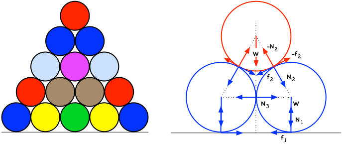

# On The Stability Of Stacked Cylinders

A little exercise on elementary Newtonian mechanics to find out the minimum coefficient of friction required for a stack of cylinders not to collapse. Originally written on July 18, 2007.

## Creator

That would be me, _Wagner Truppel_. If you need or want to contact me, send a message to `wagner` at `restlessbrain` dot com.

## License

I'm sharing this work under the [Creative Commons Attribution-ShareAlike 4.0 International (CC BY-SA 4.0)](http://creativecommons.org/licenses/by-sa/4.0/) license. See the LICENSE file for more information.
